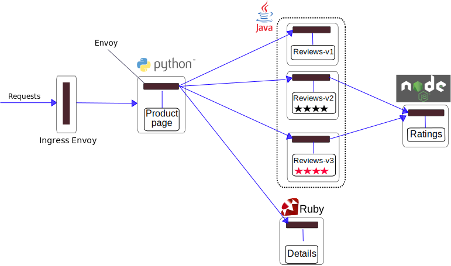

# AWS EKS

## 1. Install Kubernetes Cli, Heptio AWS Authenticator, AWS Cli and the Weave EKS Cli

The AWS EKS provides version 1.10 of Kubernetes and needs `kubectl` version `1.10.3`. 

More info:
- https://kubernetes.io/docs/tasks/tools/install-kubectl
- https://docs.aws.amazon.com/eks/latest/userguide/configure-kubectl.html

### 1.1. For Mac OSX

Install or update `kubectl`.
```sh
$ brew install kubectl
$ brew update kubectl
$ brew upgrade kubectl
$ kubectl version --short --client
Client Version: v1.10.5
```

Install `heptio-authenticator-aws`.
```sh
$ curl -o heptio-authenticator-aws https://amazon-eks.s3-us-west-2.amazonaws.com/1.10.3/2018-06-05/bin/darwin/amd64/heptio-authenticator-aws
$ chmod +x ./heptio-authenticator-aws; sudo mv ./heptio-authenticator-aws /usr/local/bin
```

Install `eksctl`.
```sh
$ curl --silent --location "https://github.com/weaveworks/eksctl/releases/download/latest_release/eksctl_$(uname -s)_amd64.tar.gz" | tar xz -C /tmp
$ sudo mv /tmp/eksctl /usr/local/bin
```

Install `awscli`. The AWS Cli is not mandatory, but sometimes it's needed to work directly with AWS API. To install it execute the next commands:
```sh
$ brew install awscli
$ brew update awscli
$ brew upgrade awscli
$ aws --version
aws-cli/1.15.40 Python/3.7.0 Darwin/17.6.0 botocore/1.10.40
```

### 1.2. For Ubuntu

Install `kubectl`.
```sh
$ sudo snap install kubectl --classic
$ kubectl version --short --client
Client Version: v1.11.0
```

Install `heptio-authenticator-aws`.
```sh
$ mkdir $HOME/bin
$ curl -o heptio-authenticator-aws https://amazon-eks.s3-us-west-2.amazonaws.com/1.10.3/2018-06-05/bin/linux/amd64/heptio-authenticator-aws
$ chmod +x ./heptio-authenticator-aws; sudo mv ./heptio-authenticator-aws $HOME/bin

$ echo 'export PATH=$HOME/bin:$PATH' >> ~/.bash_profile
$ source ~/.bash_profile

$ heptio-authenticator-aws -h
```

Install `eksctl`.
```sh
$ curl --silent --location "https://github.com/weaveworks/eksctl/releases/download/latest_release/eksctl_$(uname -s)_amd64.tar.gz" | tar xz -C /tmp
$ sudo mv /tmp/eksctl $HOME/bin
$ eksctl version
2018-07-25T15:48:04+01:00 [ℹ]  versionInfo = map[string]string{"builtAt":"2018-07-23T07:21:37Z", "gitCommit":"c332060348833792c9a69f1ef71d1c8d76c3ffd7", "gitTag":"0.1.0-beta.3"}
```

Install `awscli`.
```sh
$ sudo apt-get install -y curl
$ curl -O https://bootstrap.pypa.io/get-pip.py
$ python get-pip.py --user

$ echo 'export PATH=~/.local/bin:$PATH' >> ~/.bash_profile
$ source ~/.bash_profile

$ pip --version
pip 18.0 from /home/roger/.local/lib/python2.7/site-packages/pip (python 2.7)

$ pip install awscli --upgrade --user

$ aws --version
aws-cli/1.15.64 Python/2.7.12 Linux/4.15.0-29-generic botocore/1.10.63
```

## 2. Create an AWS EKS Cluster

### 2.1. Previous AWS preparation 

#### 2.1.2. AWS credentials

Create `~/.aws/credentials` file and fill out properly.

```sh
$ nano ~/.aws/credentials

[default]
aws_access_key_id = YOUR-AWS-ACCESS-KEY-ID-DEFAULT
aws_secret_access_key = your-aws-secret-access-key-default

[eks-usr-roger]
aws_access_key_id = YOUR-AWS-ACCESS-KEY-ID
aws_secret_access_key = your-aws-secret-access-key
```

Create `~/.aws/config` file and fill out properly.
```sh
$ nano ~/.aws/config

[default]
region = eu-west-2
output = json

[profile eks-usr-roger]
region = us-east-1
output = json
```

#### 2.1.2. Generate SSH keys

The ssh key is required only if you want to create a cluster, for other operations it is not required.
```sh
$ ssh-keygen
Generating public/private rsa key pair.
Enter file in which to save the key (/Users/Chilcano/.ssh/id_rsa):
Enter passphrase (empty for no passphrase):
Enter same passphrase again:
Your identification has been saved in /Users/Chilcano/.ssh/id_rsa.
Your public key has been saved in /Users/Chilcano/.ssh/id_rsa.pub.
[...]
```

Copy the content of `/Users/Chilcano/.ssh/id_rsa.pub` into `AWS > IAM > Users > Security credentials > Upload SSH public key`.

### 2.2. Create a Cluster

```sh
$ eksctl create cluster --name kube-rog-3 --nodes 3 --profile eks-usr-roger

2018-07-02T11:08:35+01:00 [ℹ]  importing SSH public key "/Users/Chilcano/.ssh/id_rsa.pub" as "EKS-kube-rog-3"
2018-07-02T11:08:36+01:00 [ℹ]  creating EKS cluster "kube-rog-3" in "us-west-2" region
2018-07-02T11:08:36+01:00 [ℹ]  creating ServiceRole stack "EKS-kube-rog-3-ServiceRole"
2018-07-02T11:08:36+01:00 [ℹ]  creating VPC stack "EKS-kube-rog-3-VPC"
2018-07-02T11:09:18+01:00 [✔]  created ServiceRole stack "EKS-kube-rog-3-ServiceRole"
2018-07-02T11:09:37+01:00 [✔]  created VPC stack "EKS-kube-rog-3-VPC"
2018-07-02T11:09:37+01:00 [ℹ]  creating control plane "kube-rog-3"
2018-07-02T11:20:00+01:00 [✔]  created control plane "kube-rog-3"
2018-07-02T11:20:00+01:00 [ℹ]  creating DefaultNodeGroup stack "EKS-kube-rog-3-DefaultNodeGroup"
2018-07-02T11:23:43+01:00 [✔]  created DefaultNodeGroup stack "EKS-kube-rog-3-DefaultNodeGroup"
2018-07-02T11:23:43+01:00 [✔]  all EKS cluster "kube-rog-3" resources has been created
2018-07-02T11:23:43+01:00 [ℹ]  wrote "kubeconfig"
2018-07-02T11:23:48+01:00 [ℹ]  the cluster has 0 nodes
2018-07-02T11:23:48+01:00 [ℹ]  waiting for at least 3 nodes to become ready
2018-07-02T11:24:20+01:00 [ℹ]  the cluster has 3 nodes
2018-07-02T11:24:20+01:00 [ℹ]  node "ip-192-168-123-100.us-west-2.compute.internal" is ready
2018-07-02T11:24:20+01:00 [ℹ]  node "ip-192-168-171-21.us-west-2.compute.internal" is ready
2018-07-02T11:24:20+01:00 [ℹ]  node "ip-192-168-245-243.us-west-2.compute.internal" is ready
2018-07-02T11:24:22+01:00 [ℹ]  all command should work, try '/usr/local/bin/kubectl --kubeconfig kubeconfig get nodes'
2018-07-02T11:24:22+01:00 [ℹ]  EKS cluster "kube-rog-3" in "us-west-2" region is ready
```

Other clusters:
```sh
$ eksctl create cluster --name kube-rog-5 --nodes 3
$ eksctl create cluster --name kube-rog-7 --nodes 2 --region us-east-1 --auto-kubeconfig
```

The `eksctl` will create:
- The `kubeconfig` files in your current working directory for `kube-rog-3` and `kube-rog-5` clusters, and `~/.kube/eksctl/clusters/` directory for `kube-rog-7`.
- The Kubernetes cluster will create EC2 instances of type `m5.large` by default.
- The `--profile eks-usr-roger` or `export AWS_PROFILE=eks-usr-roger` can read the `credentials` file, but not the `config` file. You have to select the `region` with `--region us-east-1`.
- With `--auto-kubeconfig` eksctl will create credentials files under `~/.kube/eksctl/clusters/` directory.

### 2.3. Useful `eksctl` commands

Install `jq`, a tool to pretty-print output from commandline.
```sh
$ sudo apt-get -y install jq
```

List existing EKS clusters in AWS.
```sh
$ eksctl get cluster 
$ eksctl get cluster --profile eks-usr-roger
$ eksctl get cluster --profile eks-usr-roger --name kube-ossie

$ eksctl get cluster --profile eks-usr-roger | sed -rn 's/.*Name: "(.*)",/\1/p'
kube-rog-3
kube-rog-5
kube-ossie

$ eksctl get cluster --profile eks-usr-roger --region us-east-1 | sed -rn 's/.*Name: "(.*)",/\1/p' 
kube-rog-7
```

Printing colors json output.
```sh
$ eksctl get cluster --profile eks-usr-roger | sed "s/.*cluster = \(.*\)/\1/g" | jq
$ eksctl get cluster --profile eks-usr-roger --name kube-ossie | sed "s/.*cluster = \(.*\)/\1/g" | jq
$ eksctl get cluster --profile eks-usr-roger --name kube-ossie | sed "s/.*cluster = \(.*\)/\1/g" | python -m json.tool
```

Getting kubeconfig file of a specified cluster.
```sh
$ eksctl utils write-kubeconfig --profile eks-usr-roger --region us-east-1 --name kube-rog-7 --kubeconfig kubeconfig.rog7

$ eksctl utils write-kubeconfig -p eks-usr-roger -r us-east-1 -n kube-rog-7 --kubeconfig kubeconfig.rog7
2018-07-26T13:43:15+01:00 [✔]  saved kubeconfig as "kubeconfig.rog7"
``` 

Deleting EKS cluster.
```sh
$ eksctl delete cluster -p eks-usr-roger -r us-east-1 -n kube-rog-7 --verbose 4
...
2018-07-26T13:46:47+01:00 [!]  as you are not using the auto-generated kubeconfig file you will need to remove the details of cluster kube-rog-7 manually
2018-07-26T13:46:47+01:00 [✔]  all EKS cluster "kube-rog-7" resource will be deleted (if in doubt, check CloudFormation console)

$ eksctl get cluster -p eks-usr-roger -r us-east-1 -n kube-rog-7 --verbose 4 | grep Status
    Status: "DELETING",
```

### 2.4. Working only with one Cluster

By default, the `eksctl` will create the `kubeconfig` file under `~/.kube/` folder, but if you want to get the `kubeconfig` for a specific cluster already created in a default region (`us-west-2`) you have to use `--kubeconfig` param.

Creating `kube01` cluster.
```sh
$ eksctl create cluster -p eks-usr-roger -n kube01 --nodes 3
```

Getting the `kubeconfig` file.
```sh
$ mkdir ~/eks
$ eksctl utils write-kubeconfig -p eks-usr-roger -n kube01 --kubeconfig ~/eks/kube01.config
```

To use `kubectl` we should load the `kubeconfig` file.
```sh
$ unset KUBECONFIG
$ export KUBECONFIG=~/eks/kube01.config

$ kubectl get nodes
NAME                                            STATUS    ROLES     AGE       VERSION
ip-192-168-147-128.us-west-2.compute.internal   Ready     <none>    11m       v1.10.3
ip-192-168-238-176.us-west-2.compute.internal   Ready     <none>    11m       v1.10.3
ip-192-168-70-63.us-west-2.compute.internal     Ready     <none>    11m       v1.10.3

$ kubectl cluster-info
Kubernetes master is running at https://C50Cxxx.yl4.us-west-2.eks.amazonaws.com

To further debug and diagnose cluster problems, use 'kubectl cluster-info dump'.
```

Checking the status.
```sh
$ kubectl get componentstatus
NAME                 STATUS    MESSAGE              ERROR
controller-manager   Healthy   ok                   
scheduler            Healthy   ok                   
etcd-0               Healthy   {"health": "true"} 
```

### 2.5. Working with multiple Clusters

We are going to create a 2nd cluster called `kube02` in the same default region.

Get the 2nd `kubeconfig` files.
```sh
$ eksctl utils write-kubeconfig -p eks-usr-roger -n kube02 --kubeconfig ~/eks/kube02.config
```

Load all `kubeconfig` files.
```sh
$ unset KUBECONFIG; export KUBECONFIG=$KUBECONFIG:~/eks/kube01.config:~/eks/kube02.config
```

Or making it permanent.
```sh
$ echo 'export KUBECONFIG=$KUBECONFIG:~/eks/kube01.config:~/eks/kube02.config' >> ~/.bash_profile
$ source ~/.bash_profile
```

Checking loaded `kubeconfig` files.
```sh
$ kubectl config view

apiVersion: v1
clusters:
- cluster:
    certificate-authority-data: REDACTED
    server: https://0A9Dxxx.yl4.us-west-2.eks.amazonaws.com
  name: kube01.us-west-2.eksctl.io
- cluster:
    certificate-authority-data: REDACTED
    server: https://C50Cxxx.yl4.us-west-2.eks.amazonaws.com
  name: kube02.us-west-2.eksctl.io
contexts:
- context:
    cluster: kube01.us-west-2.eksctl.io
    user: usr-123@kube01.us-west-2.eksctl.io
  name: usr-123@kube01.us-west-2.eksctl.io
- context:
    cluster: kube02.us-west-2.eksctl.io
    user: usr-123@kube02.us-west-2.eksctl.io
  name: usr-123@kube02.us-west-2.eksctl.io
current-context: usr-123@kube02.us-west-2.eksctl.io
kind: Config
preferences: {}
users:
- name: usr-123@kube-rog-3.us-west-2.eksctl.io
  user:
    exec:
      apiVersion: client.authentication.k8s.io/v1alpha1
      args:
      - token
      - -i
      - kube01
      command: heptio-authenticator-aws
      env:
      - name: AWS_PROFILE
        value: eks-usr-roger
- name: usr-123@kube-rog-5.us-west-2.eksctl.io
  user:
    exec:
      apiVersion: client.authentication.k8s.io/v1alpha1
      args:
      - token
      - -i
      - kube02
      command: heptio-authenticator-aws
      env: 
      - name: AWS_PROFILE
        value: eks-usr-roger
```

To use the `use-context` param to switch between different clusters.
Switching to 1st cluster.
```sh
$ kubectl config use-context usr-123@kube01.us-west-2.eksctl.io
Switched to context "usr-123@kube01.us-west-2.eksctl.io".

$ kubectl get nodes
NAME                                            STATUS    ROLES     AGE       VERSION
ip-192-168-147-128.us-west-2.compute.internal   Ready     <none>    38m       v1.10.3
ip-192-168-238-176.us-west-2.compute.internal   Ready     <none>    38m       v1.10.3
ip-192-168-70-63.us-west-2.compute.internal     Ready     <none>    38m       v1.10.3
```

Switching to 2nd cluster.
```sh
$ kubectl config use-context usr-123@kube02.us-west-2.eksctl.io
Switched to context "usr-123@kube-rog-5.us-west-2.eksctl.io".

$ kubectl get nodes
NAME                                            STATUS    ROLES     AGE       VERSION
ip-192-168-140-164.us-west-2.compute.internal   Ready     <none>    10m       v1.10.3
ip-192-168-220-10.us-west-2.compute.internal    Ready     <none>    10m       v1.10.3
ip-192-168-82-55.us-west-2.compute.internal     Ready     <none>    10m       v1.10.3
```

Getting further information.
```sh
$ kubectl get all --all-namespaces
NAMESPACE     NAME                            READY     STATUS    RESTARTS   AGE
kube-system   pod/aws-node-f97p7              1/1       Running   1          23h
kube-system   pod/aws-node-pxfhl              1/1       Running   1          23h
kube-system   pod/kube-dns-64b69465b4-z5cnr   3/3       Running   0          23h
kube-system   pod/kube-proxy-89r6j            1/1       Running   0          23h
kube-system   pod/kube-proxy-x64tm            1/1       Running   0          23h

NAMESPACE     NAME                 TYPE        CLUSTER-IP    EXTERNAL-IP   PORT(S)         AGE
default       service/kubernetes   ClusterIP   10.100.0.1    <none>        443/TCP         23h
kube-system   service/kube-dns     ClusterIP   10.100.0.10   <none>        53/UDP,53/TCP   23h

NAMESPACE     NAME                        DESIRED   CURRENT   READY     UP-TO-DATE   AVAILABLE   NODE SELECTOR   AGE
kube-system   daemonset.apps/aws-node     2         2         2         2            2           <none>          23h
kube-system   daemonset.apps/kube-proxy   2         2         2         2            2           <none>          23h

NAMESPACE     NAME                       DESIRED   CURRENT   UP-TO-DATE   AVAILABLE   AGE
kube-system   deployment.apps/kube-dns   1         1         1            1           23h

NAMESPACE     NAME                                  DESIRED   CURRENT   READY     AGE
kube-system   replicaset.apps/kube-dns-64b69465b4   1         1         1         23h
```

Further `eksctl` commands:
- https://eksctl.io

## 3. Working with the Cluster

### 3.1. Deploying Weave Scope (a Kubernetes Control Plane)

We are going to deploy Weave Scope in the cluster and exposing it by using `ClusterIP`.
```sh
$ kubectl apply -f "https://cloud.weave.works/k8s/scope.yaml?k8s-version=$(kubectl version | base64 | tr -d '\n')" 
```

Checking installation.
```sh
$ kubectl get pod,svc -n weave
NAME                                   READY     STATUS    RESTARTS   AGE
pod/weave-scope-agent-69887            1/1       Running   0          1m
pod/weave-scope-agent-6shr8            1/1       Running   0          1m
pod/weave-scope-agent-flfzt            1/1       Running   0          1m
pod/weave-scope-app-7f5f76bf89-wt785   1/1       Running   0          1m

NAME                      TYPE        CLUSTER-IP      EXTERNAL-IP   PORT(S)   AGE
service/weave-scope-app   ClusterIP   10.100.63.150   <none>        80/TCP    1m
```

Getting access to Weave Scope.
```sh
$ kubectl port-forward -n weave "$(kubectl get pod -n weave --selector=weave-scope-component=app -o jsonpath='{.items..metadata.name}')" 4040
```

Now open your this URL `http://localhost:4040` in your browser.

## 4. Implementing a Secure Service Mesh (Secure Data Plane and Control Plane)

We are going to implement a Secure Data Plane by using Envoy Proxy (https://www.envoyproxy.io) sitting in front of each App Container and being deployed as a Sidecar Container. We can do this process if we have few App Containers, but if we have several App Containers continuously retiring and redeploying them we should use a framework like Istio (https://istio.io).

Istio provides extra capabilities to manage all ecosystem, the API/Microservices based on Containers primitives and the security of course.
In other words, Istio provides:
- Uniform Observability
- Operational Agility
- Policy Driven Security

With Istio we can implement:

* Registry and Discovery
* L7 Traffic Management (L7 Segmentation, Ingress, Egress, Throttling, etc.)
* Observability (Metrics, Logs, Stats, Tracing, Correlation, ....) in real-time.
* TLS everywhere
* Service Identity (aka Container ID) based on `SPIFFE` (https://spiffe.io).
* Capability to extend Security (without a Sidecar, we can't implement end-to-end security):
  - L4/L7 Security (Sidecar works as a Firewall running in a Container)
  - Identity-based Security (SPIFFE and Sidecar)
  - IDS (Intrusion Detection System) in real-time (Sidecar detects anomalous traffic)
  - Etc.

More information about Sidecar Pattern:
- Sidecar Patterns @ Microsoft (https://docs.microsoft.com/en-us/azure/architecture/patterns/sidecar)
- Sidecar, Adapter and Abassador Patterns @ Google (https://kubernetes.io/blog/2015/06/the-distributed-system-toolkit-patterns)
- Introduction to Service Management with Istio Service Mesh (Cloud Next '18) (https://www.youtube.com/watch?v=wCJrdKdD6UM): we can see the relationship between Service Management (Istio) and API Management (Apigee)
- See GIS SecEng Document Repository.

### 4.1. Installing Istio using Helm

We are going to use `Helm` (The package manager for Kubernetes - https://helm.sh), a supported CNCF (https://www.cncf.io/blog/2018/06/01/cncf-to-host-helm) tool to deliver/install quickly (in seconds) extra components or simply our App Containers on the Kubernetes Cluster.

Install `Helm` in your host.
```sh
$ curl https://raw.githubusercontent.com/kubernetes/helm/master/scripts/get | bash
$ helm version
$ helm version --short
Client: v2.9.1+g20adb27
Server: v2.9.1+g20adb27
```

Install `Tiller` (It's the portion of `Helm` running on K8s).
```sh
$ helm init --service-account tiller
```

Download `Istio`.
```sh
$ curl -L https://git.io/getLatestIstio | sh -
$ cd istio-0.8.0
```

Patch `istioctl`. The `istioctl` doesn't work with EKS properly, especifically with `heptio-authenticator-aws`, anyway this patched `istioctl` provided for Istio will work (Ref. https://github.com/istio/istio/issues/5327#issuecomment-397845262). Then, let's download it (`istioctl_linux` - https://ibm.box.com/s/d0yg8m6ee4g17avl8g4ku2my0y96rzjj) from the browser, make it executable and add it in the `PATH`.
```sh
$ mv bin/istioctl bin/istio.backup
$ cp ~/Downloads/istioctl_linux bin/istioctl 
$ chmod +x bin/istioctl

$ echo 'export PATH=$PATH:~/eks/istio-0.8.0/bin' >> ~/.bash_profile
$ source ~/.bash_profile

$ istioctl version
Version: 919062a26aa78db9946d647be6f064b1c86b4522-dirty
GitRevision: 919062a26aa78db9946d647be6f064b1c86b4522-dirty
User: vagrant@istio
Hub: docker.io/istio
GolangVersion: go1.10.2
BuildStatus: Modified
```

Create the K8s service account that `Helm` needs to perform the deployment of `Istio`.
```sh
$ kubectl create -f install/kubernetes/helm/helm-service-account.yaml
```

Install `Istio` in the namespace `istio-system`.
```sh
$ helm install install/kubernetes/helm/istio --name istio --namespace istio-system
```

Checking Istio Pods.
```sh
$ kubectl get pod -n istio-system
NAME                                       READY     STATUS      RESTARTS   AGE
istio-citadel-7bdc7775c7-lh2h8             1/1       Running     0          11m
istio-egressgateway-795fc9b47-w9s4z        1/1       Running     0          11m
istio-ingress-84659cf44c-69rg2             1/1       Running     0          11m
istio-ingressgateway-7d89dbf85f-kw4bb      1/1       Running     0          11m
istio-mixer-post-install-wtthx             0/1       Completed   0          10m
istio-pilot-66f4dd866c-6j2vr               2/2       Running     0          11m
istio-policy-76c8896799-6d5w4              2/2       Running     0          11m
istio-sidecar-injector-645c89bc64-jzrks    1/1       Running     0          11m
istio-statsd-prom-bridge-949999c4c-rlzrr   1/1       Running     0          11m
istio-telemetry-6554768879-fp9cv           2/2       Running     0          11m
prometheus-86cb6dd77c-458lh                1/1       Running     0          11m
```

Checking Istio Services (aka `vip`).
```sh
$ kubectl get svc -n istio-system

NAME                       TYPE           CLUSTER-IP       EXTERNAL-IP                       PORT(S)                                                               AGE
istio-citadel              ClusterIP      10.100.144.85    <none>                            8060/TCP,9093/TCP                                                     8h
istio-egressgateway        ClusterIP      10.100.173.86    <none>                            80/TCP,443/TCP                                                        8h
istio-ingress              LoadBalancer   10.100.188.230   xyz.us-west-2.elb.amazonaws.com   80:32000/TCP,443:31045/TCP                                            8h
istio-ingressgateway       LoadBalancer   10.100.13.97     pqr.us-west-2.elb.amazonaws.com   80:31380/TCP,443:31390/TCP,31400:31400/TCP                            8h
istio-pilot                ClusterIP      10.100.114.248   <none>                            15003/TCP,15005/TCP,15007/TCP,15010/TCP,15011/TCP,8080/TCP,9093/TCP   8h
istio-policy               ClusterIP      10.100.24.106    <none>                            9091/TCP,15004/TCP,9093/TCP                                           8h
istio-sidecar-injector     ClusterIP      10.100.205.155   <none>                            443/TCP                                                               8h
istio-statsd-prom-bridge   ClusterIP      10.100.43.9      <none>                            9102/TCP,9125/UDP                                                     8h
istio-telemetry            ClusterIP      10.100.141.0     <none>                            9091/TCP,15004/TCP,9093/TCP,42422/TCP                                 8h
prometheus                 ClusterIP      10.100.45.68     <none>                            9090/TCP                                                              8h

```

In this point we are able to deploy any App Containers on EKS Cluster, specifically on our Secure Data Plane based on Envoy Proxy deployed as Sidecar.


### 4.2. Exploring installed Istio components

An Istio service mesh is logically split into a **data plane** and a **control
plane**.

* The **data plane** is composed of a set of intelligent proxies
  ([Envoy](https://www.envoyproxy.io/)) deployed as sidecars. These proxies
  mediate and control all network communication between microservices along
  with [Mixer](https://istio.io/docs/concepts/policies-and-telemetry/), a general-purpose
  policy and telemetry hub.

* The **control plane** manages and configures the proxies to route traffic.
  Additionally, the control plane configures Mixers to enforce policies and
  collect telemetry.

The following diagram shows the different components that make up each plane:


### 4.3. Unistalling Istio using Helm

```sh
$ helm delete --purge istio
```

If your `Helm` version is less than `2.9.0`, then you need to manually cleanup extra job resource before redeploy new version of Istio chart:
```sh
$ kubectl -n istio-system delete job --all
```

### 4.4. Customized installation of Istio using Helm

The Helm chart ships with reasonable defaults. There may be circumstances in which defaults require overrides. To override Helm values, use `--set key=value `argument during the `helm install` command. Multiple `--set` operations may be used in the same Helm operation.

Istio has a configuration by default, for example:
- `global.proxy.image`: `proxyv2`
- `global.controlPlaneSecurityEnabled`: `false`
- `global.mtls.enabled`: `false`
- `global.rbacEnabled`: `true`

The Helm chart also offers significant customization options per individual service. Customize these per-service options. The per-service options are exposed via the `values.yaml` file.

Now, if we want to enable `MTLS` (Mutual TLS Authentication) between services and `MTLS` in Istio Control Plane, we should install Istio as follow:
```sh
$ helm install install/kubernetes/helm/istio --name istio --namespace istio-system --set global.mtls.enabled=true global.controlPlaneSecurityEnabled=true
```

For more `Helm` default parameters here: https://istio.io/docs/setup/kubernetes/helm-install


### 4.5. Deploy Istio BookInfo App Demo

Istio brings a sample application (multiple APIs and Microservices) called `BookInfo` to show us all capabilities of Istio. To understand what `BookInfo` does, please check out this: https://istio.io/docs/guides/bookinfo

The Bookinfo application is broken into four separate microservices:

* `productpage`. The `productpage` microservice calls the `details` and `reviews` microservices to populate the page.
* `details`. The `details` microservice contains book information.
* `reviews`. The `reviews` microservice contains book reviews. It also calls the `ratings` microservice.
* `ratings`. The `ratings` microservice contains book ranking information that accompanies a book review.

There are 3 versions of the `reviews` microservice:

* Version v1 doesn't call the `ratings` service.
* Version v2 calls the `ratings` service, and displays each rating as 1 to 5 black stars.
* Version v3 calls the `ratings` service, and displays each rating as 1 to 5 red stars.

The end-to-end architecture of the application is shown below.





Install `BookInfo` demo in the namespace `bookinfo`. We should create the namespace `bookinfo` for our App and label it with `istio-injection=enabled` before deploying the `BookInfo` App. Behind of scenes Istio will inject automatically Envoy Proxy as Sidecar Container in each Pod.

Create the namespace `bookinfo`.
```sh
$ kubectl create namespace bookinfo
```

Verify that the kube-apiserver process has the `admission-control` flag set.
```sh
$ kubectl api-versions | grep admissionregistration
admissionregistration.k8s.io/v1beta1
```

Label the namespace `bookinfo` with `istio-injection=enabled`.
```sh
$ kubectl label namespace bookinfo istio-injection=enabled
namespace/bookinfo labeled
```

Check if label was applied.
```sh
$ kubectl get namespace -L istio-injection
NAME           STATUS    AGE       ISTIO-INJECTION
bookinfo       Active    47m       enabled
default        Active    1d        
istio-system   Active    11h       
kube-public    Active    1d        
kube-system    Active    1d        
weave          Active    1d        
```

Once done, deploy the `BookInfo` App.
```sh
$ kubectl apply -f samples/bookinfo/kube/bookinfo.yaml -n bookinfo
```

__Observation:__
- Unfortunately, Istio's automatic sidecar injection not working with EKS.
- References:
  * https://forums.aws.amazon.com/thread.jspa?threadID=285696
  * https://github.com/istio/old_issues_repo/issues/271 
- Any App should be deployed without Istio automatic sidecar injection, it should be deployed by injection sidecar manually with `istioctl kube-inject` command.

__Manual sidecar injection:__

Remove the Label that the namespace `bookinfo` has `istio-injection=enabled`.
```sh
$ kubectl label namespace bookinfo istio-injection=disabled --overwrite
namespace/bookinfo labeled

$ kubectl get namespace -L istio-injection
NAME           STATUS    AGE       ISTIO-INJECTION
bookinfo       Active    47m       disabled
default        Active    1d        
istio-system   Active    11h       
kube-public    Active    1d        
kube-system    Active    1d        
weave          Active    1d  
```

Redeploy the sidecar injected in the `BookInfo` App.
```sh
$ kubectl apply -f <(istioctl kube-inject -f samples/bookinfo/kube/bookinfo.yaml) -n bookinfo
```

Check the resources created.
```sh
$ kubectl get all -n bookinfo

NAME                                  READY     STATUS    RESTARTS   AGE
pod/details-v1-7f4b9b7775-4h4hw       2/2       Running   0          45s
pod/productpage-v1-586c4486b7-vmw5p   2/2       Running   0          39s
pod/ratings-v1-7bc49f5779-lrx9s       2/2       Running   0          44s
pod/reviews-v1-b44bd5769-cpl8f        2/2       Running   0          43s
pod/reviews-v2-6d87c8c5-dkgfb         2/2       Running   0          42s
pod/reviews-v3-79fb5c99d5-hvzvf       2/2       Running   0          41s

NAME                  TYPE        CLUSTER-IP       EXTERNAL-IP   PORT(S)    AGE
service/details       ClusterIP   10.100.109.248   <none>        9080/TCP   46s
service/productpage   ClusterIP   10.100.76.79     <none>        9080/TCP   40s
service/ratings       ClusterIP   10.100.249.240   <none>        9080/TCP   45s
service/reviews       ClusterIP   10.100.24.187    <none>        9080/TCP   43s

NAME                             DESIRED   CURRENT   UP-TO-DATE   AVAILABLE   AGE
deployment.apps/details-v1       1         1         1            1           46s
deployment.apps/productpage-v1   1         1         1            1           40s
deployment.apps/ratings-v1       1         1         1            1           45s
deployment.apps/reviews-v1       1         1         1            1           44s
deployment.apps/reviews-v2       1         1         1            1           43s
deployment.apps/reviews-v3       1         1         1            1           42s

NAME                                        DESIRED   CURRENT   READY     AGE
replicaset.apps/details-v1-7f4b9b7775       1         1         1         46s
replicaset.apps/productpage-v1-586c4486b7   1         1         1         40s
replicaset.apps/ratings-v1-7bc49f5779       1         1         1         45s
replicaset.apps/reviews-v1-b44bd5769        1         1         1         44s
replicaset.apps/reviews-v2-6d87c8c5         1         1         1         43s
replicaset.apps/reviews-v3-79fb5c99d5       1         1         1         42s
```

Since that all K8s services (aka `vip`) are of type `ClusterIP`, that means that the BookInfo App isn't accesible from Internet, and the uniqe way to get access to the application is through of Istio Ingres Gateway Pod (`istio-ingressgateway-7d89dbf85f-kw4bb`) and its Serrvice (`istio-ingressgateway`) wich is of type `LoadBalancer`.

In conclusion, if we want to call an API or Microservice running in a Secure Data Plane (Secure Service Mesh) based on Istio and Envoy Proxy, we should identify the `fqdn` of the Istio Ingres Gateway Service (`istio-ingressgateway`) and perform the request through of it. But as we are using a Secure Data Plane (Secure Service Mesh), we need to create a new route (`kind: VirtualService`) to the required API or Microservice. Below the commands:

The route (`kind: VirtualService`) for the BookInfo App.
```sh
$ cat samples/bookinfo/routing/bookinfo-gateway.yaml

apiVersion: networking.istio.io/v1alpha3
kind: Gateway
metadata:
  name: bookinfo-gateway
spec:
  selector:
    istio: ingressgateway # use istio default controller
  servers:
  - port:
      number: 80
      name: http
      protocol: HTTP
    hosts:
    - "*"
---
apiVersion: networking.istio.io/v1alpha3
kind: VirtualService
metadata:
  name: bookinfo
spec:
  hosts:
  - "*"
  gateways:
  - bookinfo-gateway
  http:
  - match:
    - uri:
        exact: /productpage
    - uri:
        exact: /login
    - uri:
        exact: /logout
    - uri:
        prefix: /api/v1/products
    route:
    - destination:
        host: productpage
        port:
          number: 9080
```

Creating the specified route in the namespace `bookinfo`.
```
$ istioctl create -f samples/bookinfo/routing/bookinfo-gateway.yaml -n bookinfo

Created config gateway/bookinfo/bookinfo-gateway at revision 206117
Created config virtual-service/bookinfo/bookinfo at revision 206122
```

Getting the `fqdn` of Istio Ingress Gateway Service (it should be of type `LoadBalancer`).
```sh
$ kubectl get svc istio-ingressgateway -n istio-system

NAME                       TYPE           CLUSTER-IP       EXTERNAL-IP                       PORT(S)                                        AGE
istio-ingressgateway       LoadBalancer   10.100.13.97     pqr.us-west-2.elb.amazonaws.com   80:31380/TCP,443:31390/TCP,31400:31400/TCP     8h
```

Then, finally we should open this URL `http://jks.us-west-2.elb.amazonaws.com:80/productpage` in our browser.

__Important:__
If you are not going to use the EKS anymore, we recommend remove the Istio route for `BookInfo` App:
```sh
$ istioctl delete -f samples/bookinfo/routing/bookinfo-gateway.yaml -n bookinfo
```