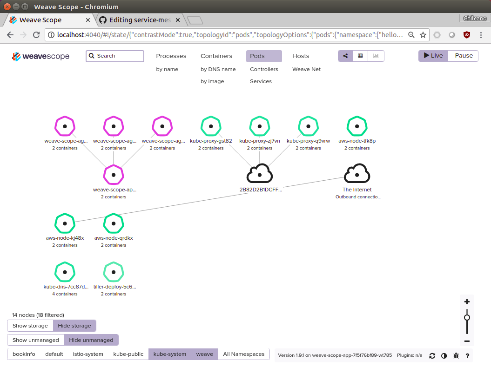

# Creating a Kubernetes Cluster on Amazon EKS

## 1. Install Kubernetes Cli, Heptio AWS Authenticator, AWS Cli and the Weave EKS Cli

The AWS EKS provides version 1.10 of Kubernetes and needs `kubectl` version `1.10.3`. 

More info:
- https://kubernetes.io/docs/tasks/tools/install-kubectl
- https://docs.aws.amazon.com/eks/latest/userguide/configure-kubectl.html
- https://www.terraform.io/docs/providers/aws/guides/eks-getting-started.html (EKS and Terraform)

### 1.1. For Mac OSX

Install or update `kubectl`.
```sh
$ brew install kubectl
$ brew update kubectl
$ brew upgrade kubectl
$ kubectl version --short --client
Client Version: v1.10.5
```

Install `heptio-authenticator-aws`.
```sh
$ curl -o heptio-authenticator-aws https://amazon-eks.s3-us-west-2.amazonaws.com/1.10.3/2018-06-05/bin/darwin/amd64/heptio-authenticator-aws
$ chmod +x ./heptio-authenticator-aws; sudo mv ./heptio-authenticator-aws /usr/local/bin
```

Install `eksctl`.
```sh
$ curl --silent --location "https://github.com/weaveworks/eksctl/releases/download/latest_release/eksctl_$(uname -s)_amd64.tar.gz" | tar xz -C /tmp
$ sudo mv /tmp/eksctl /usr/local/bin
```

Install `awscli`. The AWS Cli is not mandatory, but sometimes it's needed to work directly with AWS API. To install it execute the next commands:
```sh
$ brew install awscli
$ brew update awscli
$ brew upgrade awscli
$ aws --version
aws-cli/1.15.40 Python/3.7.0 Darwin/17.6.0 botocore/1.10.40
```

### 1.2. For Ubuntu

Install `kubectl`.
```sh
$ sudo snap install kubectl --classic
$ kubectl version --short --client
Client Version: v1.11.0
```

Install `heptio-authenticator-aws`.
```sh
$ mkdir $HOME/bin
$ curl -o heptio-authenticator-aws https://amazon-eks.s3-us-west-2.amazonaws.com/1.10.3/2018-06-05/bin/linux/amd64/heptio-authenticator-aws
$ chmod +x ./heptio-authenticator-aws; sudo mv ./heptio-authenticator-aws $HOME/bin

$ echo 'export PATH=$HOME/bin:$PATH' >> ~/.bash_profile
$ source ~/.bash_profile

$ heptio-authenticator-aws -h
```

Install `eksctl`.
```sh
$ curl --silent --location "https://github.com/weaveworks/eksctl/releases/download/latest_release/eksctl_$(uname -s)_amd64.tar.gz" | tar xz -C /tmp
$ sudo mv /tmp/eksctl $HOME/bin
$ eksctl version
2018-07-25T15:48:04+01:00 [ℹ]  versionInfo = map[string]string{"builtAt":"2018-07-23T07:21:37Z", "gitCommit":"c332060348833792c9a69f1ef71d1c8d76c3ffd7", "gitTag":"0.1.0-beta.3"}
```

Install `awscli`.
```sh
$ sudo apt-get install -y curl
$ curl -O https://bootstrap.pypa.io/get-pip.py
$ python get-pip.py --user

$ echo 'export PATH=~/.local/bin:$PATH' >> ~/.bash_profile
$ source ~/.bash_profile

$ pip --version
pip 18.0 from /home/roger/.local/lib/python2.7/site-packages/pip (python 2.7)

$ pip install awscli --upgrade --user

$ aws --version
aws-cli/1.15.64 Python/2.7.12 Linux/4.15.0-29-generic botocore/1.10.63
```

### 1.3. For windows 10 Pro

Open a `PowerShell` as `Administrator` and install `Chocolatey` (https://chocolatey.org/install).
```powershell
PS C:\> Set-ExecutionPolicy Bypass -Scope Process -Force; iex ((New-Object System.Net.WebClient).DownloadString('https://chocolatey.org/install.ps1'))
```

Install `kubectl`.
```powershell
PS C:\> choco upgrade chocolatey

PS C:\> choco install kubernetes-cli

PS C:\> kubectl version --short --client
Client Version: v1.11.2
```

Install `heptio-authenticator-aws` (It was renamed to `aws-iam-authenticator`).
```powershell
PS C:\> mkdir $HOME/bin
PS C:\> cd $HOME/bin
PS C:\> curl -o aws-iam-authenticator.exe https://amazon-eks.s3-us-west-2.amazonaws.com/1.10.3/2018-07-26/bin/windows/amd64/aws-iam-authenticator.exe
PS C:\> Setx PATH '$PATH;$HOME\bin\'

// Or
PS C:\> [Environment]::SetEnvironmentVariable("PATH", "${PATH};${HOME}\bin\")

// Re-open The PowerShell

PS C:\> aws-iam-authenticator -h
```

Install `eksctl`.
```powershell
PS C:\> cd $HOME/bin
PS C:\> [Net.ServicePointManager]::SecurityProtocol = [Net.SecurityProtocolType]::Tls12
PS C:\> Invoke-WebRequest -UseBasicParsing -Uri https://github.com/weaveworks/eksctl/releases/download/latest_release/eksctl_Windows_amd64.zip 
PS C:\> Expand-Archive -Path eksctl_Windows_amd64.zip 
PS C:\> mv .\eksctl_Windows_amd64\eksctl.exe eksctl.exe

PS C:\> eksctl version
2018-09-03T19:15:57+02:00 [ℹ]  versionInfo = map[string]string{"builtAt":"2018-08-31T14:39:24Z", "gitCommit":"0578d6cd44d8c5a4ebe17825db882ad194f0bee4", "gitTag":"0.1.1"}
```

Install `awscli`.
```powershell
PS C:\> Invoke-WebRequest -UseBasicParsing -Uri https://s3.amazonaws.com/aws-cli/AWSCLI64.msi
PS C:\> .\AWSCLI64.msi
PS C:\> aws --version
aws-cli/1.16.6 Python/2.7.9 Windows/8 botocore/1.11.6
```

## 2. Create AWS EKS Clusters for Linux and Mac OSX

### 2.1. Previous AWS preparation 

#### 2.1.2. AWS credentials

Create `~/.aws/credentials` file and fill out properly.

```sh
$ nano ~/.aws/credentials

[default]
aws_access_key_id = YOUR-AWS-ACCESS-KEY-ID-DEFAULT
aws_secret_access_key = your-aws-secret-access-key-default

[eks-usr-roger]
aws_access_key_id = YOUR-AWS-ACCESS-KEY-ID
aws_secret_access_key = your-aws-secret-access-key
```

Create `~/.aws/config` file and fill out properly.
```sh
$ nano ~/.aws/config

[default]
region = eu-west-2
output = json

[profile eks-usr-roger]
region = us-east-1
output = json
```

#### 2.1.2. Generate SSH keys

The ssh key is required only if you want to create a cluster, for other operations it is not required.
```sh
$ ssh-keygen
Generating public/private rsa key pair.
Enter file in which to save the key (/Users/Chilcano/.ssh/id_rsa):
Enter passphrase (empty for no passphrase):
Enter same passphrase again:
Your identification has been saved in /Users/Chilcano/.ssh/id_rsa.
Your public key has been saved in /Users/Chilcano/.ssh/id_rsa.pub.
[...]
```

Copy the content of `/Users/Chilcano/.ssh/id_rsa.pub` into `AWS > IAM > Users > Security credentials > Upload SSH public key`.

### 2.2. Create a Cluster

```sh
$ eksctl create cluster --name kube-rog-3 --nodes 3 --profile eks-usr-roger

2018-07-02T11:08:35+01:00 [ℹ]  importing SSH public key "/Users/Chilcano/.ssh/id_rsa.pub" as "EKS-kube-rog-3"
2018-07-02T11:08:36+01:00 [ℹ]  creating EKS cluster "kube-rog-3" in "us-west-2" region
2018-07-02T11:08:36+01:00 [ℹ]  creating ServiceRole stack "EKS-kube-rog-3-ServiceRole"
2018-07-02T11:08:36+01:00 [ℹ]  creating VPC stack "EKS-kube-rog-3-VPC"
2018-07-02T11:09:18+01:00 [✔]  created ServiceRole stack "EKS-kube-rog-3-ServiceRole"
2018-07-02T11:09:37+01:00 [✔]  created VPC stack "EKS-kube-rog-3-VPC"
2018-07-02T11:09:37+01:00 [ℹ]  creating control plane "kube-rog-3"
2018-07-02T11:20:00+01:00 [✔]  created control plane "kube-rog-3"
2018-07-02T11:20:00+01:00 [ℹ]  creating DefaultNodeGroup stack "EKS-kube-rog-3-DefaultNodeGroup"
2018-07-02T11:23:43+01:00 [✔]  created DefaultNodeGroup stack "EKS-kube-rog-3-DefaultNodeGroup"
2018-07-02T11:23:43+01:00 [✔]  all EKS cluster "kube-rog-3" resources has been created
2018-07-02T11:23:43+01:00 [ℹ]  wrote "kubeconfig"
2018-07-02T11:23:48+01:00 [ℹ]  the cluster has 0 nodes
2018-07-02T11:23:48+01:00 [ℹ]  waiting for at least 3 nodes to become ready
2018-07-02T11:24:20+01:00 [ℹ]  the cluster has 3 nodes
2018-07-02T11:24:20+01:00 [ℹ]  node "ip-192-168-123-100.us-west-2.compute.internal" is ready
2018-07-02T11:24:20+01:00 [ℹ]  node "ip-192-168-171-21.us-west-2.compute.internal" is ready
2018-07-02T11:24:20+01:00 [ℹ]  node "ip-192-168-245-243.us-west-2.compute.internal" is ready
2018-07-02T11:24:22+01:00 [ℹ]  all command should work, try '/usr/local/bin/kubectl --kubeconfig kubeconfig get nodes'
2018-07-02T11:24:22+01:00 [ℹ]  EKS cluster "kube-rog-3" in "us-west-2" region is ready
```

Other clusters:
```sh
$ eksctl create cluster --name kube-rog-5 --nodes 3
$ eksctl create cluster --name kube-rog-7 --nodes 2 --region us-east-1 --auto-kubeconfig
```

The `eksctl` will create:
- The `kubeconfig` files in your current working directory for `kube-rog-3` and `kube-rog-5` clusters, and `~/.kube/eksctl/clusters/` directory for `kube-rog-7`.
- The Kubernetes cluster will create EC2 instances of type `m5.large` by default.
- The `--profile eks-usr-roger` or `export AWS_PROFILE=eks-usr-roger` can read the `credentials` file, but not the `config` file. You have to select the `region` with `--region us-east-1`.
- With `--auto-kubeconfig` eksctl will create credentials files under `~/.kube/eksctl/clusters/` directory.

### 2.3. Useful `eksctl` commands

Install `jq`, a tool to pretty-print output from commandline.
```sh
$ sudo apt-get -y install jq
```

List existing EKS clusters in AWS.
```sh
$ eksctl get cluster 
$ eksctl get cluster --profile eks-usr-roger
$ eksctl get cluster --profile eks-usr-roger --name kube-ossie

$ eksctl get cluster --profile eks-usr-roger | sed -rn 's/.*Name: "(.*)",/\1/p'
kube-rog-3
kube-rog-5
kube-ossie

$ eksctl get cluster --profile eks-usr-roger --region us-east-1 | sed -rn 's/.*Name: "(.*)",/\1/p' 
kube-rog-7
```

Printing colors json output.
```sh
$ eksctl get cluster --profile eks-usr-roger | sed "s/.*cluster = \(.*\)/\1/g" | jq
$ eksctl get cluster --profile eks-usr-roger --name kube-ossie | sed "s/.*cluster = \(.*\)/\1/g" | jq
$ eksctl get cluster --profile eks-usr-roger --name kube-ossie | sed "s/.*cluster = \(.*\)/\1/g" | python -m json.tool
```

Getting kubeconfig file of a specified cluster.
```sh
$ eksctl utils write-kubeconfig --profile eks-usr-roger --region us-east-1 --name kube-rog-7 --kubeconfig kubeconfig.rog7

$ eksctl utils write-kubeconfig -p eks-usr-roger -r us-east-1 -n kube-rog-7 --kubeconfig kubeconfig.rog7
2018-07-26T13:43:15+01:00 [✔]  saved kubeconfig as "kubeconfig.rog7"
``` 

Deleting EKS cluster.
```sh
$ eksctl delete cluster -p eks-usr-roger -r us-east-1 -n kube-rog-7 --verbose 4
...
2018-07-26T13:46:47+01:00 [!]  as you are not using the auto-generated kubeconfig file you will need to remove the details of cluster kube-rog-7 manually
2018-07-26T13:46:47+01:00 [✔]  all EKS cluster "kube-rog-7" resource will be deleted (if in doubt, check CloudFormation console)

$ eksctl get cluster -p eks-usr-roger -r us-east-1 -n kube-rog-7 --verbose 4 | grep Status
    Status: "DELETING",
```

### 2.4. Working only with one Cluster

By default, the `eksctl` will create the `kubeconfig` file under `~/.kube/` folder, but if you want to get the `kubeconfig` for a specific cluster already created in a default region (`us-west-2`) you have to use `--kubeconfig` param.

Creating `kube01` cluster.
```sh
$ eksctl create cluster -p eks-usr-roger -n kube01 --nodes 3
```

Getting the `kubeconfig` file.
```sh
$ mkdir ~/eks
$ eksctl utils write-kubeconfig -p eks-usr-roger -n kube01 --kubeconfig ~/eks/kube01.config
```

To use `kubectl` we should load the `kubeconfig` file.
```sh
$ unset KUBECONFIG
$ export KUBECONFIG=~/eks/kube01.config

$ kubectl get nodes
NAME                                            STATUS    ROLES     AGE       VERSION
ip-192-168-147-128.us-west-2.compute.internal   Ready     <none>    11m       v1.10.3
ip-192-168-238-176.us-west-2.compute.internal   Ready     <none>    11m       v1.10.3
ip-192-168-70-63.us-west-2.compute.internal     Ready     <none>    11m       v1.10.3

$ kubectl cluster-info
Kubernetes master is running at https://C50Cxxx.yl4.us-west-2.eks.amazonaws.com

To further debug and diagnose cluster problems, use 'kubectl cluster-info dump'.
```

Checking the status.
```sh
$ kubectl get componentstatus
NAME                 STATUS    MESSAGE              ERROR
controller-manager   Healthy   ok                   
scheduler            Healthy   ok                   
etcd-0               Healthy   {"health": "true"} 
```

### 2.5. Working with multiple Clusters

We are going to create a 2nd cluster called `kube02` in the same default region.

Get the 2nd `kubeconfig` files.
```sh
$ eksctl utils write-kubeconfig -p eks-usr-roger -n kube02 --kubeconfig ~/eks/kube02.config
```

Load all `kubeconfig` files.
```sh
$ unset KUBECONFIG; export KUBECONFIG=$KUBECONFIG:~/eks/kube01.config:~/eks/kube02.config
```

Or making it permanent.
```sh
$ echo 'export KUBECONFIG=$KUBECONFIG:~/eks/kube01.config:~/eks/kube02.config' >> ~/.bash_profile
$ source ~/.bash_profile
```

Checking loaded `kubeconfig` files.
```sh
$ kubectl config view

apiVersion: v1
clusters:
- cluster:
    certificate-authority-data: REDACTED
    server: https://0A9Dxxx.yl4.us-west-2.eks.amazonaws.com
  name: kube01.us-west-2.eksctl.io
- cluster:
    certificate-authority-data: REDACTED
    server: https://C50Cxxx.yl4.us-west-2.eks.amazonaws.com
  name: kube02.us-west-2.eksctl.io
contexts:
- context:
    cluster: kube01.us-west-2.eksctl.io
    user: usr-123@kube01.us-west-2.eksctl.io
  name: usr-123@kube01.us-west-2.eksctl.io
- context:
    cluster: kube02.us-west-2.eksctl.io
    user: usr-123@kube02.us-west-2.eksctl.io
  name: usr-123@kube02.us-west-2.eksctl.io
current-context: usr-123@kube02.us-west-2.eksctl.io
kind: Config
preferences: {}
users:
- name: usr-123@kube-rog-3.us-west-2.eksctl.io
  user:
    exec:
      apiVersion: client.authentication.k8s.io/v1alpha1
      args:
      - token
      - -i
      - kube01
      command: heptio-authenticator-aws
      env:
      - name: AWS_PROFILE
        value: eks-usr-roger
- name: usr-123@kube-rog-5.us-west-2.eksctl.io
  user:
    exec:
      apiVersion: client.authentication.k8s.io/v1alpha1
      args:
      - token
      - -i
      - kube02
      command: heptio-authenticator-aws
      env: 
      - name: AWS_PROFILE
        value: eks-usr-roger
```

To use the `use-context` param to switch between different clusters.
Switching to 1st cluster.
```sh
$ kubectl config use-context usr-123@kube01.us-west-2.eksctl.io
Switched to context "usr-123@kube01.us-west-2.eksctl.io".

$ kubectl get nodes
NAME                                            STATUS    ROLES     AGE       VERSION
ip-192-168-147-128.us-west-2.compute.internal   Ready     <none>    38m       v1.10.3
ip-192-168-238-176.us-west-2.compute.internal   Ready     <none>    38m       v1.10.3
ip-192-168-70-63.us-west-2.compute.internal     Ready     <none>    38m       v1.10.3
```

Switching to 2nd cluster.
```sh
$ kubectl config use-context usr-123@kube02.us-west-2.eksctl.io
Switched to context "usr-123@kube-rog-5.us-west-2.eksctl.io".

$ kubectl get nodes
NAME                                            STATUS    ROLES     AGE       VERSION
ip-192-168-140-164.us-west-2.compute.internal   Ready     <none>    10m       v1.10.3
ip-192-168-220-10.us-west-2.compute.internal    Ready     <none>    10m       v1.10.3
ip-192-168-82-55.us-west-2.compute.internal     Ready     <none>    10m       v1.10.3
```

Getting further information.
```sh
$ kubectl get all --all-namespaces
NAMESPACE     NAME                            READY     STATUS    RESTARTS   AGE
kube-system   pod/aws-node-f97p7              1/1       Running   1          23h
kube-system   pod/aws-node-pxfhl              1/1       Running   1          23h
kube-system   pod/kube-dns-64b69465b4-z5cnr   3/3       Running   0          23h
kube-system   pod/kube-proxy-89r6j            1/1       Running   0          23h
kube-system   pod/kube-proxy-x64tm            1/1       Running   0          23h

NAMESPACE     NAME                 TYPE        CLUSTER-IP    EXTERNAL-IP   PORT(S)         AGE
default       service/kubernetes   ClusterIP   10.100.0.1    <none>        443/TCP         23h
kube-system   service/kube-dns     ClusterIP   10.100.0.10   <none>        53/UDP,53/TCP   23h

NAMESPACE     NAME                        DESIRED   CURRENT   READY     UP-TO-DATE   AVAILABLE   NODE SELECTOR   AGE
kube-system   daemonset.apps/aws-node     2         2         2         2            2           <none>          23h
kube-system   daemonset.apps/kube-proxy   2         2         2         2            2           <none>          23h

NAMESPACE     NAME                       DESIRED   CURRENT   UP-TO-DATE   AVAILABLE   AGE
kube-system   deployment.apps/kube-dns   1         1         1            1           23h

NAMESPACE     NAME                                  DESIRED   CURRENT   READY     AGE
kube-system   replicaset.apps/kube-dns-64b69465b4   1         1         1         23h
```

Further `eksctl` commands:
- https://eksctl.io


## 3. Create AWS EKS Clusters for Windows 10 Pro

### 3.1. Previous AWS preparation 

#### 3.1.1. AWS credentials

Create `$HOME\.aws\credentials` file and fill out properly.

```powershell
PS C:\> nano $HOME\.aws\credentials

[default]
aws_access_key_id = YOUR-AWS-ACCESS-KEY-ID-DEFAULT
aws_secret_access_key = your-aws-secret-access-key-default

[eks-usr-roger]
aws_access_key_id = YOUR-AWS-ACCESS-KEY-ID
aws_secret_access_key = your-aws-secret-access-key
```

Create $HOME\.aws\config` file and fill out properly.
```powershell
PS C:\> nano $HOME\.aws\config

[default]
region = eu-west-2
output = json

[profile eks-usr-roger]
region = us-east-1
output = json
```

#### 3.1.2. Generate SSH keys

The ssh key is required only if you want to create a cluster, for other operations it is not required.
```powershell
PS C:\> ssh-keygen
```

Copy the content of `/Users/Chilcano/.ssh/id_rsa.pub` into `AWS > IAM > Users > Security credentials > Upload SSH public key`.

### 3.2. Create and working with multiple Clusters

Creating `kube01` and `kube02` clusters.
```powershell
PS C:\> eksctl create cluster -p eks-usr-roger -n kube01 --nodes 3
PS C:\> eksctl create cluster -p eks-usr-roger -n kube02 --nodes 3
```

Getting the `kubeconfig` files.
```powershell
PS C:\> mkdir $HOME/eks
PS C:\> eksctl utils write-kubeconfig -p eks-usr-roger -n kube01 --kubeconfig $HOME\eks\kube01.config
PS C:\> eksctl utils write-kubeconfig -p eks-usr-roger -n kube02 --kubeconfig $HOME\eks\kube02.config
```

Load all `kubeconfig` files permanently (`User` context).
```powershell
PS C:\> [Environment]::SetEnvironmentVariable("KUBECONFIG", $null)
PS C:\> [Environment]::SetEnvironmentVariable("KUBECONFIG", "${HOME}\eks\kube01.config;${HOME}\eks\kube02.config")
PS C:\> [environment]::GetEnvironmentVariable("KUBECONFIG")
```

Checking loaded `kubeconfig` files.
```powershell
PS C:\> kubectl config view
```

To use the `use-context` param to switch between different clusters. Switching to 1st cluster.
```powershell
PS C:\> kubectl config use-context usr-123@kube01.us-west-2.eksctl.io
Switched to context "usr-123@kube01.us-west-2.eksctl.io".

PS C:\> kubectl get nodes
```

Switching to 2nd cluster.
```powershell
PS C:\> kubectl config use-context usr-123@kube02.us-west-2.eksctl.io
Switched to context "usr-123@kube-rog-5.us-west-2.eksctl.io".

PS C:\> kubectl get nodes
```

Checking the status.
```powershell
PS C:\> kubectl get componentstatus
NAME                 STATUS    MESSAGE              ERROR
controller-manager   Healthy   ok                   
scheduler            Healthy   ok                   
etcd-0               Healthy   {"health": "true"} 
```

Getting further information.
```powershell
PS C:\> kubectl get all --all-namespaces
```

## 4. Exploring the Cluster

We are going to deploy Weave Scope, a web application to browse the cluster, in the cluster and exposing it by using `ClusterIP`.
```sh
$ kubectl apply -f "https://cloud.weave.works/k8s/scope.yaml?k8s-version=$(kubectl version | base64 | tr -d '\n')" 
```

Checking installation.
```sh
$ kubectl get pod,svc -n weave
NAME                                   READY     STATUS    RESTARTS   AGE
pod/weave-scope-agent-69887            1/1       Running   0          1m
pod/weave-scope-agent-6shr8            1/1       Running   0          1m
pod/weave-scope-agent-flfzt            1/1       Running   0          1m
pod/weave-scope-app-7f5f76bf89-wt785   1/1       Running   0          1m

NAME                      TYPE        CLUSTER-IP      EXTERNAL-IP   PORT(S)   AGE
service/weave-scope-app   ClusterIP   10.100.63.150   <none>        80/TCP    1m
```

Getting access to Weave Scope.
```sh
$ kubectl port-forward -n weave "$(kubectl get pod -n weave --selector=weave-scope-component=app -o jsonpath='{.items..metadata.name}')" 4040
```

Now open your this URL `http://localhost:4040` in your browser.

> 
> 
> _Exploring the EKS Cluster with Weave Scope._
