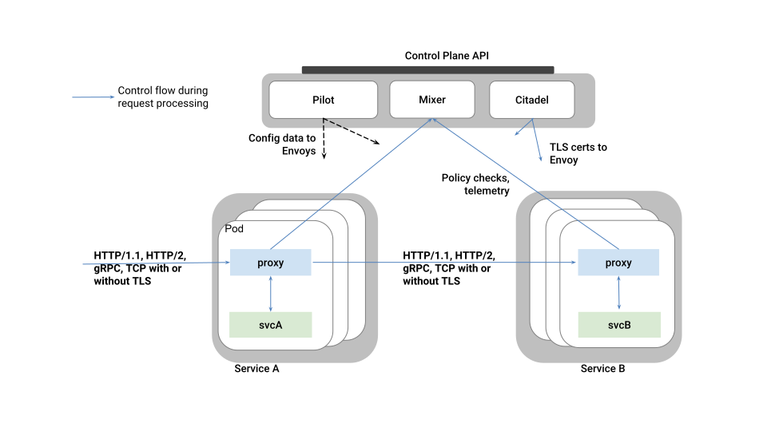
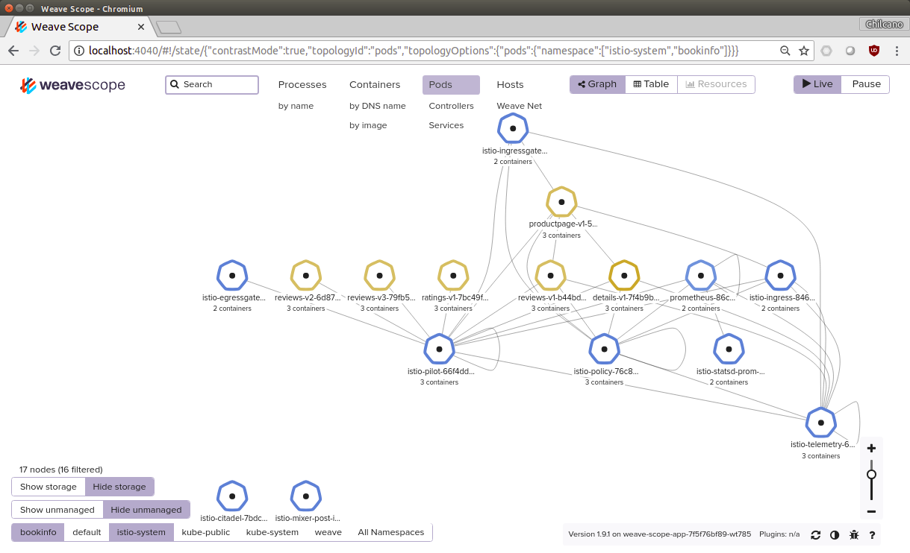

# Implementing a Secure Service Mesh with Istio 1.0 on Amazon EKS

## 1. Data Plane and Control Plane in a Service Mesh

A Service Mesh is logically split into a **Data Plane** and a **Control Plane**.

* The **Data Plane** is composed of a set of intelligent proxies
  ([Envoy Proxy](https://www.envoyproxy.io)) deployed as sidecars. These proxies
  mediate and control all network communication between microservices along
  with [Mixer](https://istio.io/docs/concepts/policies-and-telemetry/), a general-purpose
  policy and telemetry hub.

* The **Control Plane** manages and configures the proxies to route traffic.
  Additionally, the control plane configures Mixers to enforce policies and
  collect telemetry.

The following diagram shows the different components that make up each plane:

> 
> 
> _High level Istio Architecture and Components._

Deploying Sidecars for each App Container and managing them is easy for a few App Containers, but if we have several App Containers continuously retiring and redeploying them we should use a framework like Istio (https://istio.io).

Istio provides extra capabilities to manage all ecosystem, the API/Microservices based on Containers primitives and the security of course.
In other words, Istio provides:
- Uniform Observability
- Operational Agility
- Policy Driven Security

With Istio we can implement:

* Registry and Discovery
* L7 Traffic Management (L7 Segmentation, Ingress, Egress, Throttling, etc.)
* Observability (Metrics, Logs, Stats, Tracing, Correlation, ....) in real-time.
* TLS everywhere
* Service Identity (aka Container ID) based on `SPIFFE` (https://spiffe.io).
* Capability to extend Security (without a Sidecar, we can't implement end-to-end security):
  - L4/L7 Security (Sidecar works as a Firewall running in a Container)
  - Identity-based Security (SPIFFE and Sidecar)
  - IDS (Intrusion Detection System) in real-time (Sidecar detects anomalous traffic)
  - Etc.

More information about Sidecar Pattern:
- Sidecar Patterns @ Microsoft (https://docs.microsoft.com/en-us/azure/architecture/patterns/sidecar)
- Sidecar, Adapter and Abassador Patterns @ Google (https://kubernetes.io/blog/2015/06/the-distributed-system-toolkit-patterns)
- Introduction to Service Management with Istio Service Mesh (Cloud Next '18) (https://www.youtube.com/watch?v=wCJrdKdD6UM): we can see the relationship between Service Management (Istio) and API Management (Apigee)
- See GIS SecEng Document Repository.

## 2. Install Istio using Helm and Tiller

We are going to use `Helm` (The package manager for Kubernetes - https://helm.sh), a supported CNCF (https://www.cncf.io/blog/2018/06/01/cncf-to-host-helm) tool to deliver/install quickly (in seconds) extra components or simply our App Containers on the Kubernetes Cluster.

__Install `Helm`__

`Helm` is going to be installed in your host.
```sh
$ curl https://raw.githubusercontent.com/kubernetes/helm/master/scripts/get | bash
$ helm version
$ helm version --short
Client: v2.9.1+g20adb27
Server: v2.9.1+g20adb27
```

__Download and install latest version of Istio__

```sh
$ cd ~/eks
$ curl -L https://git.io/getLatestIstio | sh -
$ cd istio-1.0.0
```

Since we have `Helm` version less than `2.10`, we have to install Custom Resource Definitions via `kubectl apply`.
```bash
$ kubectl apply -f install/kubernetes/helm/istio/templates/crds.yaml
```

Install `Tiller`, the portion of `Helm` running on K8s. A Service Account should be installed for `Tiller`.
```sh
$ helm reset
$ kubectl delete -f install/kubernetes/helm/helm-service-account.yaml
$ kubectl create -f install/kubernetes/helm/helm-service-account.yaml
$ helm init --service-account tiller
```

Install Istio.
```sh
$ helm install install/kubernetes/helm/istio --name istio --namespace istio-system \
  --set galley.enabled=false
```

If you install Istio with `--set sidecarInjectorWebhook.enabled=false`, the `istio-sidecar-injector` will not be created.
```sh
$ helm install install/kubernetes/helm/istio --name istio --namespace istio-system \
  --set galley.enabled=false \
  --set sidecarInjectorWebhook.enabled=false
```

__Check Istio__

Check if the required `istio` and `istio-sidecar-injector` ConfigMaps were created. Those are required for manual sidecar injection.
```sh
$ kubectl get configmap -n istio-system
NAME                                    DATA      AGE
istio                                   1         6m
istio-ingress-controller-leader-istio   0         2h
istio-security-custom-resources         2         6m
istio-sidecar-injector                  1         6m
istio-statsd-prom-bridge                1         6m
prometheus                              1         6m
```

Checking Istio Pods.
```sh
$ kubectl get pod -n istio-system
NAME                                        READY     STATUS    RESTARTS   AGE
istio-citadel-5b956fdf54-dmfxv              1/1       Running   0          2h
istio-egressgateway-6cff45b4db-s9sfg        1/1       Running   0          2h
istio-ingressgateway-fc648887c-8vtpt        1/1       Running   0          2h
istio-pilot-6cd95f9cc4-4xj2l                2/2       Running   0          2h
istio-policy-75f75cc6fd-pzxz2               2/2       Running   0          2h
istio-statsd-prom-bridge-7f44bb5ddb-8h8cz   1/1       Running   0          2h
istio-telemetry-544b8d7dcf-lplqv            2/2       Running   0          2h
prometheus-84bd4b9796-qk85s                 1/1       Running   0          2h
```

Checking Istio Services (aka `vip`).
```sh
$ kubectl get svc -n istio-system

NAME                       TYPE           CLUSTER-IP       EXTERNAL-IP                       PORT(S)                                                                                                     AGE
istio-citadel              ClusterIP      10.100.158.49    <none>                            8060/TCP,9093/TCP                                                                                           3h
istio-egressgateway        ClusterIP      10.100.212.134   <none>                            80/TCP,443/TCP                                                                                              3h
istio-ingressgateway       LoadBalancer   10.100.135.155   xxx.us-west-2.elb.amazonaws.com   80:31380/TCP,443:31390/TCP,31400:31400/TCP,15011:32422/TCP,8060:31206/TCP,15030:30785/TCP,15031:30764/TCP   3h
istio-pilot                ClusterIP      10.100.218.237   <none>                            15010/TCP,15011/TCP,8080/TCP,9093/TCP                                                                       3h
istio-policy               ClusterIP      10.100.199.106   <none>                            9091/TCP,15004/TCP,9093/TCP                                                                                 3h
istio-statsd-prom-bridge   ClusterIP      10.100.83.158    <none>                            9102/TCP,9125/UDP                                                                                           3h
istio-telemetry            ClusterIP      10.100.174.31    <none>                            9091/TCP,15004/TCP,9093/TCP,42422/TCP                                                                       3h
prometheus                 ClusterIP      10.100.147.138   <none>                            9090/TCP                                                                                                    3h
```

In this point we are able to deploy any App Containers on EKS Cluster, specifically on our Secure Data Plane based on Envoy Proxy deployed as Sidecar.

__Customized installation of Istio using Helm.__

The Helm chart also offers significant customization options per individual service. Customize these per-service options. The per-service options are exposed via the `values.yaml` file.
For example, if we want to enable `MTLS` (Mutual TLS Authentication) between services and `MTLS` in Istio Control Plane, we should install Istio as follow:
```sh
$ helm install install/kubernetes/helm/istio --name istio --namespace istio-system \
  --set global.mtls.enabled=true \
  --set global.controlPlaneSecurityEnabled=true
```

__List deployed Helm Charts.__

```sh
$ helm list
NAME 	REVISION	UPDATED                 	STATUS  	CHART      	NAMESPACE   
istio	1       	Sat Jul 28 03:20:21 2018	DEPLOYED	istio-0.8.0	istio-system
```

__Delete/Uninstall deployed Helm Chart.__

```sh
$ helm delete --purge istio
```

If your `Helm` version is less than `2.9.0`, then you need to manually cleanup extra job resource before redeploy new version of Istio chart:
```sh
$ kubectl -n istio-system delete job --all
```

For more `Helm` default parameters here: https://istio.io/docs/setup/kubernetes/helm-install

## 2. Create a Secure Data Plane (Inject Sidecars to App Containers)

To get a Secure Data Plane for any Container-based Application, we should inject a sidecar proxy for each container. What we are doing here is connecting each App Containers through its respective sidecar. Then, we are going to take a specific Distributed Container-based Application and will inject **automatically** or **manually** the sidecars.

### 2.1. Istio's BookInfo Application

The [BookInfo Applcation](https://istio.io/docs/guides/bookinfo) that Istio provides us is the best way to learn and understand how to a Secure Service Mesh works. The Bookinfo application is broken into four separate microservices:

* `productpage`. The `productpage` microservice calls the `details` and `reviews` microservices to populate the page.
* `details`. The `details` microservice contains book information.
* `reviews`. The `reviews` microservice contains book reviews. It also calls the `ratings` microservice.
* `ratings`. The `ratings` microservice contains book ranking information that accompanies a book review.

There are 3 versions of the `reviews` microservice:

* Version v1 doesn't call the `ratings` service.
* Version v2 calls the `ratings` service, and displays each rating as 1 to 5 black stars.
* Version v3 calls the `ratings` service, and displays each rating as 1 to 5 red stars.

The end-to-end architecture of the application is shown below.

> 
> 
> _Bookinfo Application without Istio._

> 
> 
> _Bookinfo Application with Istio (Envoy Proxy as Sidecar)._

__References:__

- https://github.com/arun-gupta/istio-kubernetes-aws
- https://medium.com/@mahesh.rayas/istio-deploy-sample-bookinfo-to-aws-eks-543b59474783 


#### 2.1.1. Installing BookInfo with automatic sidecar injection.

> Unfortunately, Istio's automatic sidecar injection not working with EKS. 
> If you are using Istio 0.8, you can use the patched `istioctl` ( see  https://github.com/istio/istio/issues/5327#issuecomment-397845262 ) 
> References:
>  * https://forums.aws.amazon.com/thread.jspa?threadID=285696
>  * https://github.com/istio/old_issues_repo/issues/271
>  * https://istio.io/about/notes/1.0/

If Istio was deployed with Automatic Sidecar Injector, then you should follow the next steps:

Create the namespace `bookinfo`.
```sh
$ kubectl create namespace bookinfo
```

Verify that the kube-apiserver process has the `admission-control` flag set.
```sh
$ kubectl api-versions | grep admissionregistration
admissionregistration.k8s.io/v1beta1
```

Label the namespace `bookinfo` with `istio-injection=enabled`.
```sh
$ kubectl label namespace bookinfo istio-injection=enabled
namespace/bookinfo labeled
```

Check if label was applied.
```sh
$ kubectl get namespace -L istio-injection
NAME           STATUS    AGE       ISTIO-INJECTION
bookinfo       Active    47m       enabled
default        Active    1d        
istio-system   Active    11h       
kube-public    Active    1d        
kube-system    Active    1d        
weave          Active    1d        
```

Once done, deploy the `BookInfo` App.
```sh
$ kubectl apply -f samples/bookinfo/kube/bookinfo.yaml -n bookinfo
```

#### 2.1.2. Installing BookInfo Application with manual sidecar injection.

We have to get the existing sidecar injection and mesh configuration available (`istio` and `istio-sidecar-injector` ConfigMaps) after of successful *standard* Istio installation.

```sh
$ kubectl -n istio-system get configmap istio-sidecar-injector -o=jsonpath='{.data.config}' > inject-config.yaml
$ kubectl -n istio-system get configmap istio -o=jsonpath='{.data.mesh}' > mesh-config.yaml
```

Make sure to remove/disable the Label for the namespace `bookinfo`. It should be `istio-injection=disabled`.
```sh
$ kubectl create namespace bookinfo

$ kubectl label namespace bookinfo istio-injection=disabled --overwrite
namespace/bookinfo labeled

$ kubectl get namespace -L istio-injection
```

Add `istioctl` to `$PATH`
```sh
$ cd ~/eks/istio-1.0.0
$ echo 'export PATH=$PATH:~/eks/istio-1.0.0/bin' >> ~/.bash_profile
$ source ~/.bash_profile

$ istioctl version
Version: 1.0.0
GitRevision: 3a136c90ec5e308f236e0d7ebb5c4c5e405217f4
User: root@71a9470ea93c
Hub: gcr.io/istio-release
GolangVersion: go1.10.1
BuildStatus: Clean
```

Inject Istio sidecar manually in BookInfo Application with extracted `istio` and `istio-sidecar-injector` ConfigMaps. The new Deployment YAML file is going to be persisted into `bookinfo-injected.yaml`.
```sh
$ istioctl kube-inject \
    --injectConfigFile inject-config.yaml \
    --meshConfigFile mesh-config.yaml \
    -f samples/bookinfo/platform/kube/bookinfo.yaml \
    -o bookinfo-injected.yaml
```

Deploy the `BookInfo` Application with the sidecar injected manually in the previous step.
```sh
$ kubectl apply -f bookinfo-injected.yaml -n bookinfo
```

Check the resources created.
```sh
$ kubectl get pod,svc -n bookinfo

NAME                                  READY     STATUS    RESTARTS   AGE
pod/details-v1-7f4b9b7775-4h4hw       2/2       Running   0          45s
pod/productpage-v1-586c4486b7-vmw5p   2/2       Running   0          39s
pod/ratings-v1-7bc49f5779-lrx9s       2/2       Running   0          44s
pod/reviews-v1-b44bd5769-cpl8f        2/2       Running   0          43s
pod/reviews-v2-6d87c8c5-dkgfb         2/2       Running   0          42s
pod/reviews-v3-79fb5c99d5-hvzvf       2/2       Running   0          41s

NAME                  TYPE        CLUSTER-IP       EXTERNAL-IP   PORT(S)    AGE
service/details       ClusterIP   10.100.109.248   <none>        9080/TCP   46s
service/productpage   ClusterIP   10.100.76.79     <none>        9080/TCP   40s
service/ratings       ClusterIP   10.100.249.240   <none>        9080/TCP   45s
service/reviews       ClusterIP   10.100.24.187    <none>        9080/TCP   43s
```

> 
> 
> _Browsing the Secure Service Mesh (BookInfo and Istio) from Weave Scope._

__Calling the BookInfo Application over HTTP__

Since that all K8s services (aka `vip`) are of type `ClusterIP`, that means that the BookInfo App isn't accesible from Internet, and the uniqe way to get access to the application is through of Istio Ingres Gateway Pod (`istio-ingressgateway-7d89dbf85f-kw4bb`) and its Service (`istio-ingressgateway`) wich is of type `LoadBalancer`.

In conclusion, if we want to call an API or Microservice running in a Secure Data Plane (Secure Service Mesh) based on Istio and Envoy Proxy, we should identify the `fqdn` of the Istio Ingres Gateway Service (`istio-ingressgateway`) and perform the request through of it. But as we are using a Secure Data Plane (Secure Service Mesh), we need to create a new route (`kind: VirtualService`) to the required API or Microservice. Below the commands:

The route (`kind: VirtualService`) for the BookInfo App is `samples/bookinfo/networking/bookinfo-gateway.yaml`:

```yaml
apiVersion: networking.istio.io/v1alpha3
kind: Gateway
metadata:
  name: bookinfo-gateway
spec:
  selector:
    istio: ingressgateway # use istio default controller
  servers:
  - port:
      number: 80
      name: http
      protocol: HTTP
    hosts:
    - "*"
---
apiVersion: networking.istio.io/v1alpha3
kind: VirtualService
metadata:
  name: bookinfo
spec:
  hosts:
  - "*"
  gateways:
  - bookinfo-gateway
  http:
  - match:
    - uri:
        exact: /productpage
    - uri:
        exact: /login
    - uri:
        exact: /logout
    - uri:
        prefix: /api/v1/products
    route:
    - destination:
        host: productpage
        port:
          number: 9080
```

Creating the specified route in the namespace `bookinfo`.
```sh
$ istioctl create -f samples/bookinfo/networking/bookinfo-gateway.yaml -n bookinfo

Created config gateway/bookinfo/bookinfo-gateway at revision 206117
Created config virtual-service/bookinfo/bookinfo at revision 206122
```

Getting the `fqdn` of Istio Ingress Gateway Service (it should be of type `LoadBalancer`).
```sh
$ kubectl get svc istio-ingressgateway -n istio-system

NAME                       TYPE           CLUSTER-IP       EXTERNAL-IP                       PORT(S)                                        AGE
istio-ingressgateway       LoadBalancer   10.100.13.97     pqr.us-west-2.elb.amazonaws.com   80:31380/TCP,443:31390/TCP,31400:31400/TCP     8h
```

If the `EXTERNAL-IP` value is set, your environment has an external load balancer that you can use for the ingress gateway. If the `EXTERNAL-IP` value is `<none>` (or perpetually `<pending>`), your environment does not provide an external load balancer for the ingress gateway. In this case, you can access the gateway using the service’s [NodePort](https://kubernetes.io/docs/concepts/services-networking/service/#nodeport).

In this case we have an external load balancer (Amazon ELB).
```sh
$ export INGRESS_HOST=$(kubectl -n istio-system get service istio-ingressgateway -o jsonpath='{.status.loadBalancer.ingress[0].hostname}')
$ export INGRESS_PORT=$(kubectl -n istio-system get service istio-ingressgateway -o jsonpath='{.spec.ports[?(@.name=="http2")].port}')
$ export SECURE_INGRESS_PORT=$(kubectl -n istio-system get service istio-ingressgateway -o jsonpath='{.spec.ports[?(@.name=="https")].port}')
```
Then, finally we should open this URL `http://$INGRESS_HOST:$INGRESS_PORT/productpage`in our browser or `https://$INGRESS_HOST:$INGRESS_PORT/productpage` for `HTTPS`.

> 
> 
> _Accessing to BookInfo's ProductPage._


__Calling the BookInfo Application over HTTPS (simple TLS)__

Follow this: https://istio.io/docs/tasks/traffic-management/secure-ingress

__Important:__

If you are not going to use the EKS anymore, we recommend remove the Istio route for `BookInfo` App:
```sh
$ istioctl delete -f samples/bookinfo/networking/bookinfo-gateway.yaml -n bookinfo
```

__Other `istioctl` commands:__

```sh
$ istioctl get virtualservices -n bookinfo
VIRTUAL-SERVICE NAME   GATEWAYS           HOSTS     #HTTP     #TCP      NAMESPACE   AGE
bookinfo               bookinfo-gateway   *             1        0      bookinfo    1m

$ istioctl get gateway -n bookinfo
GATEWAY NAME       HOSTS     NAMESPACE   AGE
bookinfo-gateway   *         bookinfo    1m
```

## 3. Reviviewing the BookInfo Applicatiom

TBC
